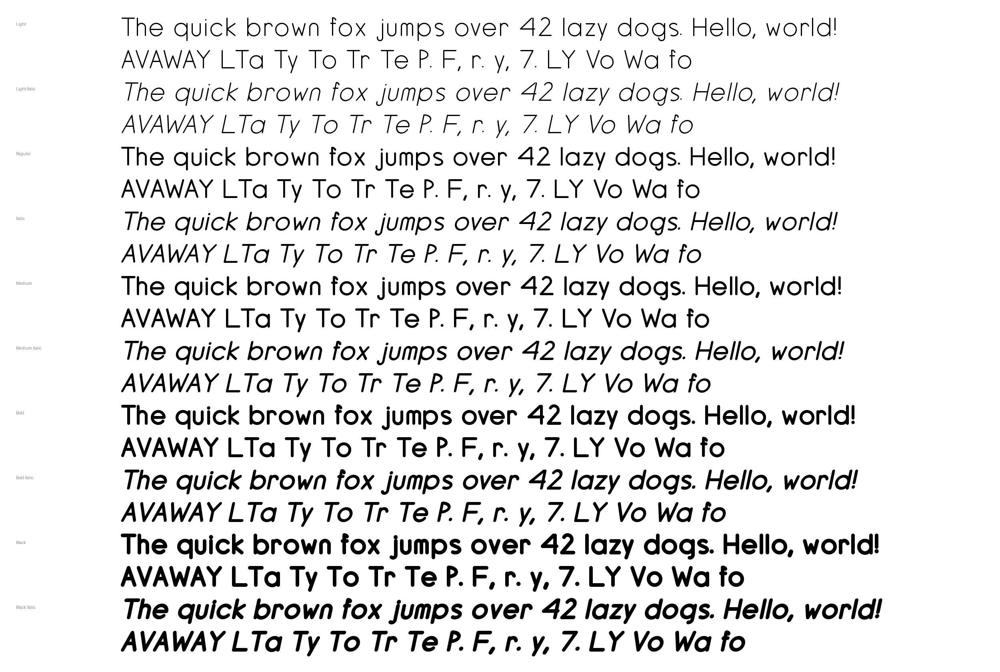

# Aperture

Seven typefaces generated from one set of stroke skeletons. Every letter is
authored once, as the centerline path a pen would travel; each face is that
same path inked under a different pen model. A fix to a skeleton lands in
all seven faces (and all ten sans styles) on the next build.

Specimen page: <https://jimothyjohn.github.io/fonts/>



## The faces

| Face | File | Pen model |
| --- | --- | --- |
| **Sans** | `aperture-sans*.ttf` | Round pen of constant width. Ten styles: Light, Regular, Medium, Bold, Black, each upright and oblique. Heavier weights re-sweep the same centerlines with a wider pen; obliques are the uprights sheared about the baseline. |
| **Serif** | `aperture-serif.ttf` | Axis-aligned elliptical pen (thick stems, thin bars, vertical stress) plus bracketed feet generated from each skeleton's declared terminals. A newsprint text serif. |
| **Script** | `aperture-script.ttf` | Skeletons sheared right, lowercase given exit tails that curve up into the letter gap so words read as connected flow. |
| **Hand** | `aperture-hand.ttf` | Variable-pressure ink (heavier on downstrokes, tapered at landings and lifts), hand wobble, and per-glyph tilt, squash and baseline drift. |
| **Moderne** | `aperture-moderne.ttf` | Pointed-pen expansion: width follows stroke angle, so verticals are full weight and horizontals collapse to hairlines. A Didone display face. |
| **Olde** | `aperture-olde.ttf` | Broad nib held at a fixed angle, with curves fractured into short straight segments. Textura blackletter. |
| **Marquee** | `aperture-marquee.ttf` | Each stroke replaced by a string of evenly spaced round bulbs, a seeded fraction of them burnt out. Carnival signage. |

Each face has an alphabet sheet (`out/alphabet-<face>.png`) and a specimen
sheet (`out/specimen-<face>.png`).

Coverage is A–Z, a–z, 0–9, space, and `! , - . : ?` (69 glyphs). The sans
family also carries a GPOS kerning table.

## Using the fonts

Download the TTFs, individually or as one zip, from the
[Releases page](https://github.com/JimothyJohn/fonts/releases). They are
also tracked in the repo: `out/*.ttf` is the canonical copy, and
`docs/fonts/` mirrors them for the specimen page. Install them like any
other TrueType font, or load them on the web:

```css
@font-face {
  font-family: "Aperture Sans";
  src: url("fonts/aperture-sans-bold.ttf") format("truetype");
  font-weight: 700;
}
```

Builds are deterministic (a fixed `head` timestamp, no randomness that isn't
seeded), so a TTF only changes in a diff when its source did.

## Building

Requires Python 3.12+ and [uv](https://docs.astral.sh/uv/).

```sh
uv sync
scripts/build-all.sh          # every face: TTFs, alphabet + specimen sheets, docs/fonts mirror
scripts/build-all.sh serif    # one face: sans|serif|script|hand|moderne|olde|marquee
uv run pytest
uvx ruff check . && uvx ruff format --check .
```

`build-all.sh` prints every path it writes and exits non-zero on the first
failure. Any edit under `fontgen/` changes tracked artifacts, so run it
before committing.

## How it works

- **Skeletons** (`fontgen/glyphs.py`). Each glyph is a function that
  assembles strokes, bowls and rings from `fontgen/primitives.py` against a
  shared grid (`fontgen/metrics.py`: 1000 UPM, cap height 700, stroke 78).
  Shapes are unioned with Shapely so T-junctions and bowl-to-stem joins have
  no internal seams. The function also declares every free stroke end as a
  terminal, which is what the serif face grows feet from.
- **Replay.** `primitives.record_strokes()` captures the centerline every
  primitive is about to buffer. The serif, script, hand, moderne, olde,
  marquee faces and the non-Regular sans weights all replay those
  centerlines and ink them their own way rather than re-authoring letters.
- **Vertical contract.** A straight stroke's centerline sits on its
  guideline; a curve overshoots it by a fixed amount. `tests/test_glyphs.py`
  pins this per glyph, and `build_font` shifts every face so the flats' ink
  rests on the baseline with real cap-height and x-height metrics.
- **Spacing and kerning.** Bearings are normalized from ink extremes, then
  tightened per glyph for rounds and diagonals (`fontgen/spacing.py`).
  Sans kerning pairs are measured from the glyphs' own geometry
  (`fontgen/kerning.py`): the felt gap between two glyphs' convex hulls,
  row by row, closed to a target. Nothing is typed in by hand.
- **Assembly** (`fontgen/build.py`). Contours go straight into fontTools'
  `FontBuilder`; there is no intermediate UFO or Glyphs file.

## Layout

```
fontgen/     skeletons, pen models, metrics, spacing, kerning, TTF assembly
scripts/     make_font*.py (one per face), render_*.py (sheets), build-all.sh
tests/       per-face and per-glyph geometry tests
out/         built TTFs and PNG sheets (tracked); scratch variants (ignored)
docs/        GitHub Pages specimen site and its copy of the TTFs
demo/        handwriting demo that replays pen strokes exported by scripts/make_strokes.py
```

Other scripts: `make_jitter_variants.py` builds N near-identical TTFs with
per-glyph jitter for a typewriter-strike effect, `version_fonts.py` snapshots
the current builds as numbered versions, and `make_demo.py` emits a
standalone copy of the demo with stroke data inlined.

## Development

Work happens on feature branches merged into `dev` by PR; CI runs lint,
the test suite, and a full build of all seven faces on every PR, and green
checks auto-merge. `master` is the published line: GitHub Pages serves the
specimen site from `master:/docs`.

To cut a release, promote `dev` to `master` and push a `v*` tag. The release
workflow rebuilds every face on the runner, refuses to publish unless the
rebuild is byte-identical to the tracked TTFs, and attaches the sixteen TTFs
plus a zip to a GitHub Release.

## License

Apache License 2.0. See [LICENSE](LICENSE).
